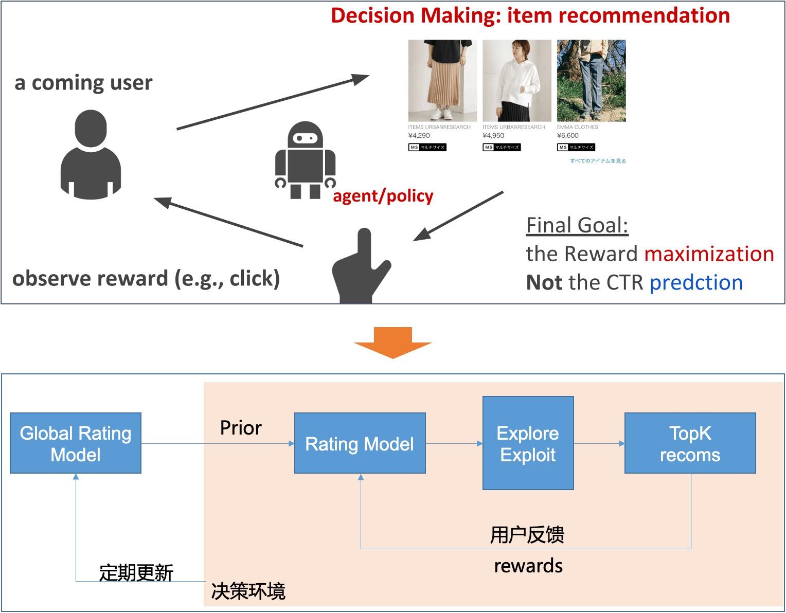

# 快速入门

本指南介绍了如何训练和生成模型服务。

## 数据格式
`banditrl` 希望数据被存储在[duckdb](https://duckdb.org/)。具体来说，一个duckdb查询字符串应该被传入`banditrl.get_dataset(query_str)`，该字符串返回一个具有以下模式的数据集。

- <b>mdp_id (STRING)</b>: 这个样本是马尔科夫决策过程的一部分的ID。通常在推荐问题中，每个单独的推荐是整个会话的一部分（在这种情况下，这些样本将是同一个会话ID的一部分，它将作为`mdp_id`）。强化学习算法通过MDP学习。
- <b>sequence_number (INT)</b>: 用户action在 "mdp" 中的顺序位置。
- <b>context (STRING)</b>: 一个JSON字符串，映射用于决策的上下文（即输入到模型的特征）。上下文的值可以是`numeric`（用于数字特征）或`str`（用于分类或ID列表特征）。
- <b>decision (STRING)</b>: banditrl作出的决策.
- <b>reward (FLOAT)</b>: 表明这一决策好坏的分数。

Sample records:
```
| row | mdp_id | sequence_number | context                      | decision | reward |
|-----|--------|-----------------|------------------------------|----------|--------|
|  1  |  u123  |        1        | {"spin_cnt": 2, "rt": "2019-01-01"} |  DC1  |  99.2 |
|  2  |  u456  |        1        | {"spin_cnt": 4, "rt": "2022-01-01"} |   DC4   |  399.9 |
```
## 用于决策的机器学习(Bandit/RL)

我们经常使用机器学习来做决定，而不是预测。

