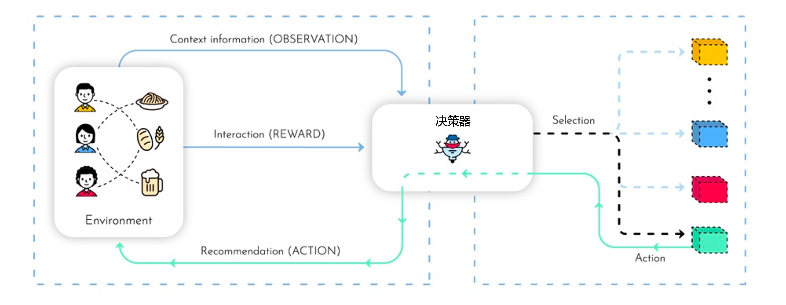
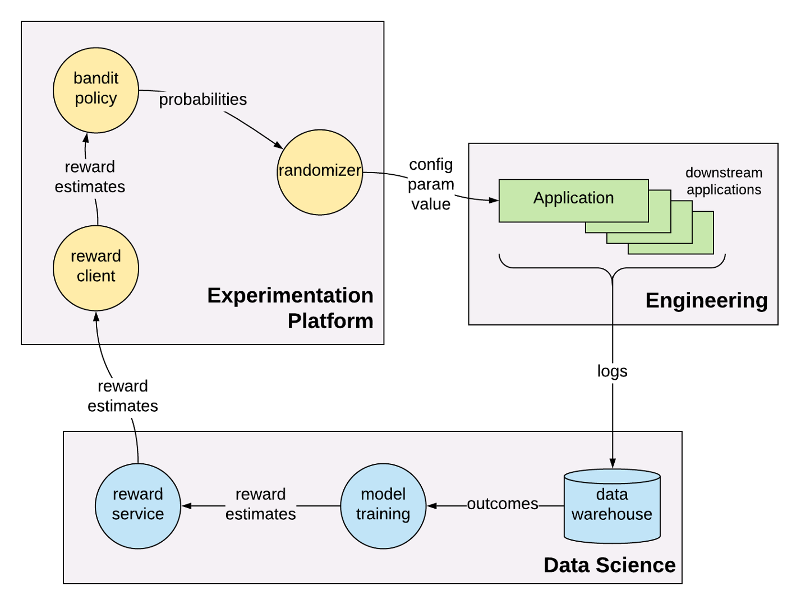

<h1 align="center"><a href="https://github.com/AlgoLink/banditrl">banditrl</a></h1>
<p align="center">
    <em>A lightweight contextual bandit &amp; reinforcement learning library</em>
</p>
<p align="center">
    <a href="https://img.shields.io/github/checks-status/AlgoLink/banditrl/main" target="_blank">
        
    </a>
    <a href="https://img.shields.io/github/downloads/AlgoLink/banditrl/total" target="_blank">
        
    </a>
    <a href="https://img.shields.io/github/commit-activity/w/AlgoLink/banditrl" target="_blank">
        
    </a>
    <a href="https://img.shields.io/github/stars/AlgoLink/banditrl?style=social" target="_blank">
        
    </a>
</p>

# banditrl
一个轻量级的上下文bandit和强化学习库，旨在用于生产中的实时决策服务。

- [项目简介](#项目简介)
- [技术架构](#技术架构)
- [当前支持的模型](#当前支持的模型)
- [当前支持的特征类型](#当前支持的特征类型)
- [Docs](#Docs)
  - [Contextual Free(User model)](#contextual-free)
  - [Contextual Bandits](#contextual-bandits)


## 项目简介

<div align="center" >
  
</div>

本项目的目标是建立一个灵活简单的在线学习库，并且有足够的性能在生产中使用。在许多现实世界的应用中（例如，推荐系统），action的数量和每秒请求的数量可能非常大，所以我们应该非常小心地管理模型存储、action存储和历史请求数据的存储。因为不同系统的存储管理是非常不同的，我们让用户可以定义如何做。
具体来说，这个 repo 包含：

- 特征工程和预处理
- 模型实现
- 模型训练工作流程
- 基于FastAPI的在线模型服务
- 模型存储：更新后如何存储模型，如何加载模型
- 历史请求数据存储：如何存储请求，并在我们获得（延迟的）奖励时找到它
- 行动存储：如何添加/删除行动并定义每个行动的一些特殊属性

banditrl提供了核心的上下文bandit算法，以及一些常见的存储操作（如内存存储/基于Rlite/redis的存储）。

## 技术架构


## 当前支持的模型

Models supported:

- Contextual Bandits
  - [x] [Linear bandit(LinUCB)](https://dl.acm.org/doi/abs/10.1145/1772690.1772758)
  - [x] [Linear Thompson Sampling bandit(LinTS)](http://proceedings.mlr.press/v28/agrawal13)
  - [x] ε-greedy (LinEpsilonGreedy)
  - [x] [Logistic bandit(Logistic Upper Confidence Bound-LogisticUCB)](https://dl.acm.org/doi/10.1145/2396761.2396767)
- Contextual Free(User model)
  - [x] Epsilon Greedy policy bandit(RliteEE)
  - [x] Bernoulli Thompson Sampling Policy bandit(BTS) [(via. Thompson Sampling
)](https://towardsdatascience.com/thompson-sampling-fc28817eacb8)

## 当前支持的特征类型

<b>4</b> feature types supported:
* <b>Numeric:</b> standard floating point features
  * e.g. `{totalCartValue: 39.99}`
* <b>Categorical:</b> low-cardinality discrete features
  * e.g. `{currentlyViewingCategory: "men's jeans"}`
* <b>ID list:</b> high-cardinality discrete features
  * e.g. `{productsInCart: ["productId022", "productId109"...]}`
  * Handled via. learned embedding tables
* <b>"Dense" ID list:</b> high-cardinality discrete features, manually mapped to dense feature vectors
  * e.g `{productId022: [0.5, 1.3, ...], productId109: [1.9, 0.1, ...], ...}`

## Docs

```
pip install .
```

[Get started](DOCS.md)

### Contextual Free(User model)

[Epsilon Greedy policy bandit(RliteEE)](docs/rliteee.md)

[Bernoulli Thompson Sampling Policy bandit(BTS)](docs/bts.md)

### Contextual Bandits
[Linear bandit(LinUCB)](docs/linucb_array.md)

[Linear bandit(LinUCB) using dict context](docs/linucb_dict.md)

[Logistic bandit(Logistic Upper Confidence Bound-LogisticUCB)](docs/logistic_ucb.md)