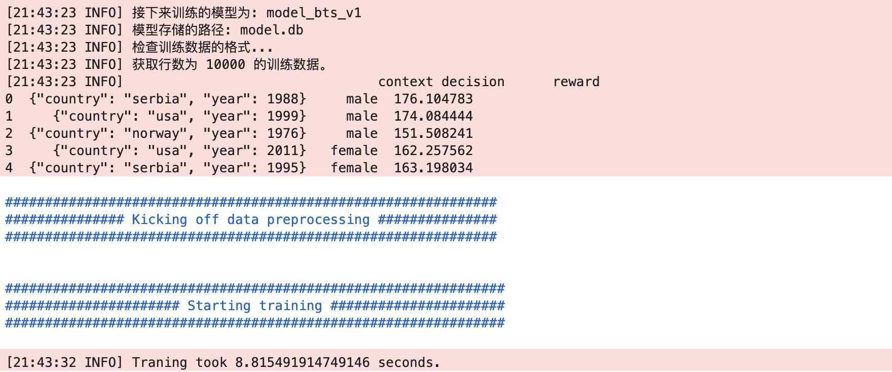

## 模型训练

```
from banditrl.training.trainer import train
import pandas as pd

df = pd.read_csv("height_dataset.csv")

ml_config = {
    "model_id": "model_bts_v1",
    "storage":{
        "model":{"type":"rlite",
                 "path":"model.db"},
        "his_context":{},
        "action":{},
        "predictor_save_dir":None
    },
    "features":{"context_free":True},
    "model_type": "bts",
    "reward_type": "regression",
    "model_params": {"bts":{}}
}

test = train(
    training_df= df,
    ml_config= ml_config,
    feature_config= None,
    itemid_to_action ={},
    offline_train = True
)
```
训练日志


## 模型预测

```
## 模型预测

from banditrl.serving import predictor


ml_config = {
    "model_id": "model_bts_v1",
    "storage":{
        "model":{"type":"rlite",
                 "path":"model.db"},
        "his_context":{},
        "action":{},
        "predictor_save_dir":None
    },
    "features":{"context_free":True},
    "model_type": "bts",
    "reward_type": "regression",
    "model_params": {"bts":{}}
}

test=predictor.BanditPredictor(ml_config)
model = test.build_model
uid=3
model_id="model_bts_v1"
uid_model=f"{uid}_{model_id}"
model.get_action(topN=1,model_id= uid_model)
```
实时反馈

```
model.reward(action = "male",reward=189.0,model_id=uid_model)
```