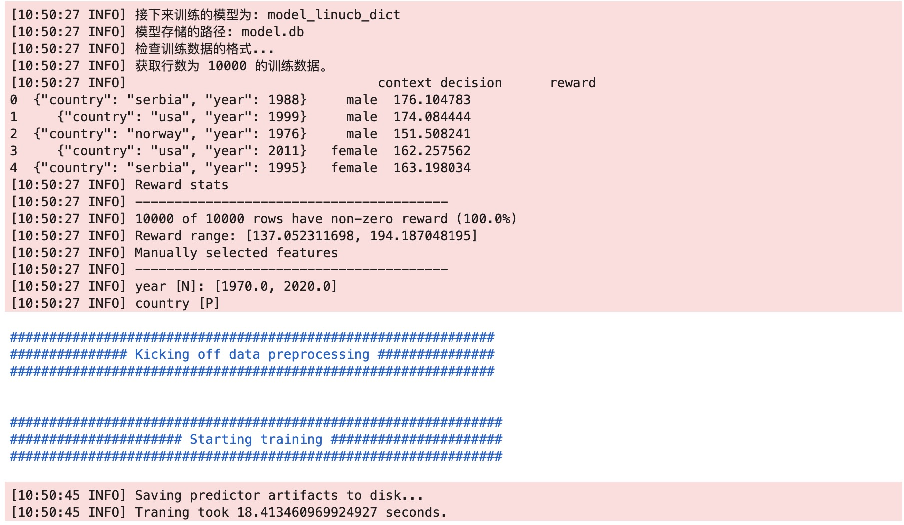

## 模型训练

```
from banditrl.training.trainer import train
import pandas as pd
df = pd.read_csv("height_dataset.csv")
ml_config = {
    "model_id": "model_linucb_dict",
    "storage":{
        "model":{"type":"rlite", "path":"model.db"},
        "his_context":{"type":"rlite", "path":"his_context.db"},
        "action":{},
        "predictor_save_dir":"models"
    },
    "features": {
        "context_free":False,
        "features_to_use": ["*"],
        "dense_features_to_use": ["*"]
    },
    "feature_importance": {
        "calc_feature_importance": False,
        "keep_only_top_n": True,
        "n": 10
    },
    "model_type": "linucb_dict",
    "reward_type": "regression",
    "model_params": {
        "linucb_dict":{"context_dim":None, "n_actions":2}
    }
}

feature_config = {
        "choices": ["male", "female"],
        "features": {
            "country": {"type": "P", "product_set_id": "1", "use_dense": False},
            "year": {"type": "N"},
            #"decision": {"type": "C"},
        },
        "product_sets": {
            "1": {
                "ids": ["usa", "china", "india", "serbia", "norway"],
                "dense": {
                    "usa": ["north-america", 10.0],
                    "china": ["asia", 8.5],
                    "india": ["asia", 7.5],
                    "serbia": ["europe", 11.5],
                    "norway": ["europe", 10.5],
                },
                "features": [
                    {"name": "region", "type": "C"},
                    {"name": "avg_shoe_size_m", "type": "N"},
                ],
            }
        },
}

test=train(
    training_df=df,
    ml_config = ml_config,
    feature_config = feature_config,
    itemid_to_action = {"male":0,"female":1}
)
```
训练日志


## 模型预测
```
from banditrl.serving import predictor

ml_config = {
    "model_id": "model_linucb_dict",
    "storage":{
        "model":{"type":"rlite", "path":"model.db"},
        "his_context":{"type":"rlite", "path":"his_context.db"},
        "action":{},
        "predictor_save_dir":"models"
    },
    "features": {
        "context_free":False,
        "features_to_use": ["*"],
        "dense_features_to_use": ["*"]
    },
    "feature_importance": {
        "calc_feature_importance": False,
        "keep_only_top_n": True,
        "n": 10
    },
    "model_type": "linucb_dict",
    "reward_type": "regression",
    "model_params": {
        "linucb_dict":{"context_dim":1, "n_actions":2}
    }
}

test=predictor.BanditPredictor(ml_config)
model = test.build_model
feat=test.build_feature_transformer

%%time
request_id = "test_predict3"
model_id = "model_linucb_dict"
_features = {"country": "usa", "year": 1999}
recom = test.get_action(_features,request_id,model_id,2)
recom

response:
['female', 'male']
```
实时反馈

```
request_id='test_predict1'
action='male'
reward = 178
model_id="model_linucb_v2.1"
test.reward(request_id,action,reward, model_id)
````