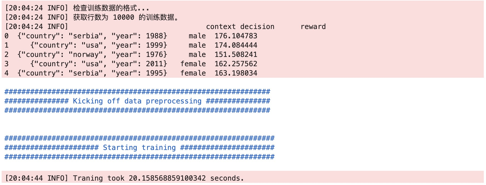

## 模型训练

```
from banditrl.training.trainer import train
import pandas as pd

df = pd.read_csv("height_dataset.csv")

ml_config = {
    "model_id": "model_rliteee_v1",
    "storage":{
        "model":{"type":"rlite",
                 "path":"model.db"},
        "his_context":{},
        "action":{},
        "predictor_save_dir":None
    },
    "features":{"context_free":True},
    "model_type": "rliteee",
    "reward_type": "regression",
    "model_params": {"rliteee":{}}
}

test = train(
    training_df= df,
    ml_config= ml_config,
    feature_config= None,
    itemid_to_action ={},
    offline_train = True
)
```
训练日志


## 模型预测
```
from banditrl.serving import predictor

ml_config = {
    "model_id": "model_rliteee_v1",
    "storage":{
        "model":{"type":"rlite",
                 "path":"model.db"},
        "his_context":{},
        "action":{},
        "predictor_save_dir":None
    },
    "features":{"context_free":True},
    "model_type": "rliteee",
    "reward_type": "regression",
    "model_params": {"rliteee":{}}
}

test=predictor.BanditPredictor(ml_config)
model = test.build_model
model.select_model(uid=3,model_id="model_rliteee_v1",topN=2)

## 统一版本
from banditrl.serving import predictor
ml_config = {
    "model_id": "model_rliteee_v2",
    "storage":{
        "model":{"type":"rlite",
                 "path":"model.db"},
        "his_context":{},
        "action":{},
        "predictor_save_dir":None
    },
    "features":{"context_free":True},
    "model_type": "rliteee",
    "reward_type": "regression",
    "model_params": {"rliteee":{}}
}
test=predictor.BanditPredictor(ml_config)
test.get_action(request_id="2",model_id="model_rliteee_v2",topN=2,uid="1")

```
实时反馈

```
model.reward_model(model="male",uid=3,model_id="model_rliteee_v1",reward=156.0)
````